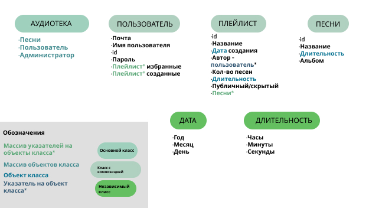

# Индивидуальный проект

**Выбранная предметная область:** АУДИОТЕКА.

**Цель работы:** реализовать платформу для хранения информации о музыки, поиска песен, добавления в различные плейлисты, а также в избранные.

## Задачи проекта:
1. Реализовать платформу для хранения музыки.
2. Приложение должно обеспечивать возможность пользователю:
	- осуществлять поиск песен,
	- добавлять псени в избранные,
	- добавлять песни в созданный пользователем плейлист.
3. Приложение должно обеспечивать возможность администратору быстро и легко выполнять свои функции:
	- добавлять новые песни.
	
## Функциональные требования:
Приложение реализуется в виде windows-приложения с удобным навигационным меню, качественным отображением информации и простыми формами для заполнения и хранения данных. Основные возможности, которые будут предусмотрены приложением:

1. Приложение реализуется с авторизацией по логину/паролю.
2. Основной режим работы приложения предоставляет пользователю возможность взаимодействовать с песнями, представленными на платформе.
3. Доступ к особому режиму создания/изменения песен будет осуществляться по особому логину/паролю, которые будут выданы администратору.
4. Все данные будут храниться в csv-формате и подтягиваться при очередном запуске приложения.

[How_work_Vector](/source/How_work_Vector.pdf)
